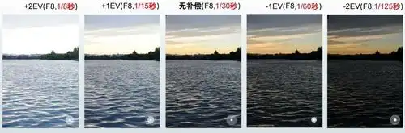
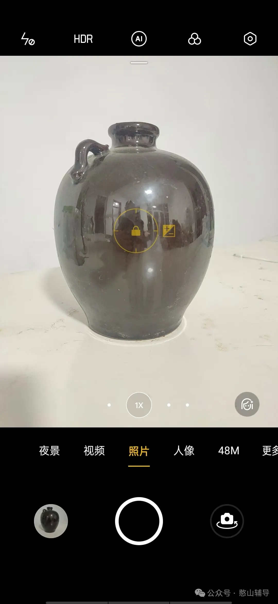
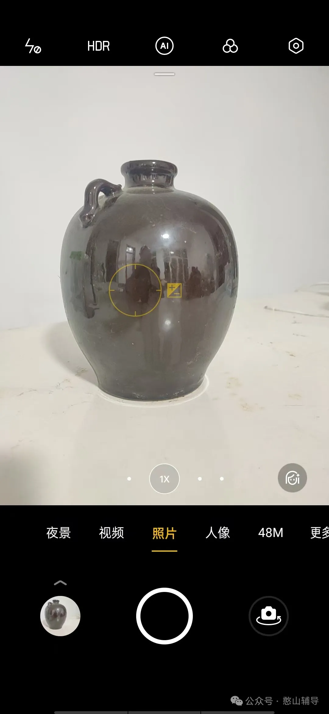
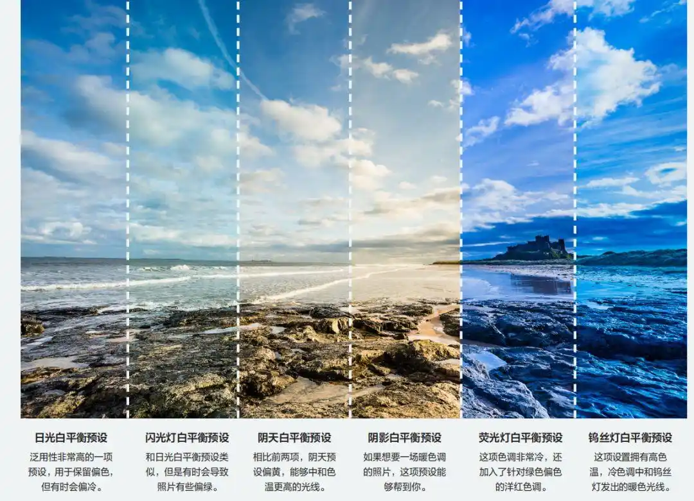

# 摄影五大参数

## ISO（感光度）
ISO：是衡量相机感光元件对光线敏感程度的指标‌。 
### 作用
ISO值越高，感光元件对光线的敏感度越强，能够在低光环境下拍摄出更亮的照片，但可能会引入更多的噪点；  
ISO值越低，感光元件对光线的敏感度越弱，照片噪点减少，但可能需要更长的曝光时间或更强的光源‌。

### 建议
在光线充足的环境下‌，尽量使用较低的 ISO 值（如ISO 100 或 200）以保证照片的清晰度和细腻度，选择较快的快门速度以减少模糊‌。  
在光线不足的情况下‌，可以适当提高 ISO 值以增加曝光，但需注意控制噪点的影响，选择较慢的快门速度以捕捉更多的光线‌。

## S（快门速度）
Shutter Speed: 即相机镜头从打开到关闭的时间长度‌。
### 作用
快门速度的快慢直接影响照片的曝光时间和运动物体的清晰度。  
较快的快门速度（如1/1000秒）能够冻结运动物体的瞬间，减少模糊；较慢的快门速度（如几秒甚至更长）则能够捕捉更多的光线，表现出动态模糊或长曝光效果（如流水、星轨等）‌。
### 建议
在拍摄运动物体或需要快速捕捉瞬间画面的场景时，应选择较快的快门速度；  
在拍摄静态物体或需要长曝光效果的场景时，则可以选择较慢的快门速度。

## EV（曝光值）
EV（Exposure Value）‌：EV代表曝光值，是一种用于调整相机曝光量的参数。
### 作用
曝光补偿允许用户在不改变相机自动测光结果的前提下，手动调整照片的曝光量。  
当相机自动测光不准确时（如逆光、雪景等场景），通过增加或减少曝光补偿可以使照片达到更准确的曝光效果。

### 建议
在逆光拍摄时，可以适当增加曝光补偿以避免主体过暗；  
在拍摄亮部占比较大的场景时，可以适当减少曝光补偿以避免过曝。

### 测光EV
手机拍照一般也会自动调整曝光度，优点是正常光线下拍摄简单。  
手动测光跟对焦一样点击一下屏幕，长按选光点圈内就会出现小太阳，上下拖动右边的滑动按钮调整到合适的曝光度，然后锁定就可以拍照了。  
优点可用于逆光拍摄、高反光（河流湖海等）拍摄，高调和低调拍摄。

## Focus（对焦）
Focus: 是相机中用于调整焦点的功能。  
### 焦段

#### 广角：捕捉宏大与创意
广角焦段，通常指手机相机中低于 1X 焦距的拍摄模式，如 0.5X 或 0.6X 等，其视野广阔，能捕捉到更宏大的场景，是拍摄大场景风光和建筑的利器。  
广角：0.6 适合风景拍摄   

#### 标准：还原真实日常
标准焦段，也就是我们手机相机默认的 1X 焦距，其视角接近人眼的正常视角，大约在 45° - 50° 之间 ，成像效果自然、真实，给人一种身临其境的感觉，是日常拍摄中最常用的焦段之一。

#### 长焦：拉近远方之美
长焦：适合远景特写
长焦焦段，一般指手机相机中高于 1X 焦距的拍摄模式，如 2X、3X 甚至更高倍数的变焦，能够将远处的景物拉近，可以捕捉到远处的细节，实现背景虚化，突出主体。  
适合拍摄人像特写、野生动物、远处的风景等场景，是探索远方世界的得力助手。

### 对焦模式
#### AF：自动对焦（Auto Focus)
在摄影中，AF有两种模式，包括：  
AF-S（单次自动对焦）‌：适用于拍摄静止的物体，一旦完成对焦，焦点会被锁定直到拍摄完成‌。   
AF-C（连续自动对焦）‌：适用于拍摄运动的物体，相机会持续对焦，确保拍摄对象始终清晰‌。

#### MF：手动对焦（Manual Focus）
手动对焦模式下，用户需要手动旋转镜头上的对焦环来调整焦距，使被拍摄物体清晰成像。  
允许用户通过触摸屏幕或调整对焦环来手动设置焦点。这种方式在特定场景下（如微距摄影、低光环境等）非常有用。  
手动对焦需要摄影师具备一定的技巧和经验，因为它要求摄影师准确判断被摄物体与相机之间的距离，并手动调整焦距。

手机拍照一般会自动锁定对焦“小方框”，优点是远景或近景都能清晰。  
**手动对焦技巧：点屏对焦：想要哪里清晰就点哪里。优点是焦距确定“那个点”清晰，近景对焦可以虚化背景。**

### 建议
根据拍摄对象的运动状态和拍摄需求选择合适的对焦方式。  
对于静止的物体，可以选择AF-S；对于运动的物体，可以选择AF-C；在需要精确控制对焦位置的场景下，可以选择MF

## WB（白平衡）
White Balance：是调整光线种类和温度的参数，用于校正照片的色彩偏差‌。
**数值越大（如5500k）呈暖色调，数值越小（如2300k）呈现冷色调。**
白平衡通过调整照片中的色调和饱和度，使得照片能够在不同的光源下（如日光、钨丝灯、荧光灯等）都能保持物体颜色的准确性。  
这是因为不同光源的色温不同，会导致照片颜色出现偏差。  
例如，在日光下拍摄的照片颜色通常比较自然，但在钨丝灯下拍摄的照片则容易偏黄。白平衡就是用来解决这种颜色偏差问题的。

资料来源：https://mp.weixin.qq.com/s?__biz=Mzg2NzU4NTM2OA==&mid=2247496973&idx=1&sn=13fab5fc06c8de34c9feb68c4e6b5a81&chksm=cf95e4e4001acc3b4a1587eee977e38a8cd92da5345518a0cd1c08760785a05ffba99b60701a&scene=27
